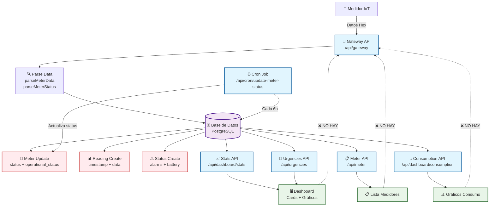
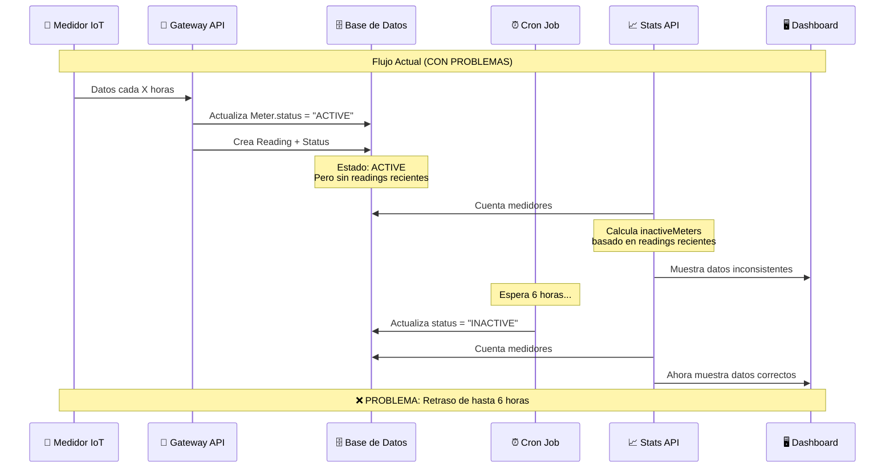
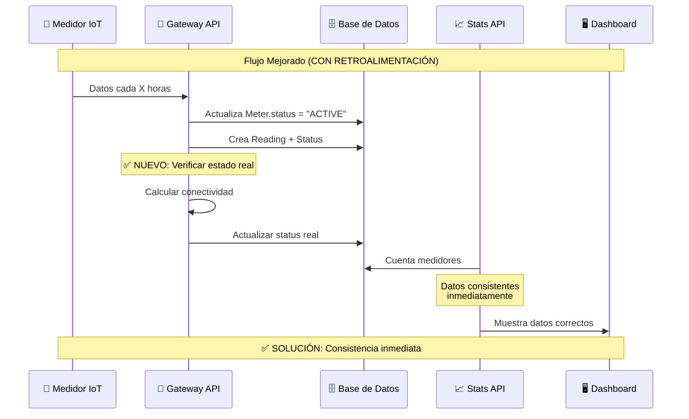

# 🔄 Ecosistema de APIs - EcoWater

## 📊 Diagrama de Flujo de Datos



## 🔄 Flujo de Estados (Problema Actual)



## 🔄 Flujo de Estados (Solución Propuesta)



## 🎯 Problemas Identificados

### **1. Falta de Retroalimentación**

- **Gateway API**: Solo actualiza cuando llegan datos nuevos
- **Stats API**: Calcula estados en tiempo real pero no actualiza BD
- **Cron Job**: Actualiza BD pero con retraso de hasta 6 horas

### **2. Inconsistencias Temporales**

- **Tiempo de inconsistencia**: Hasta 6 horas
- **Impacto**: Dashboard muestra datos incorrectos
- **Frecuencia**: Cada vez que un medidor se vuelve inactivo

### **3. Información Redundante**

- **Stats API**: Devuelve datos que no se usan en el dashboard
- **Urgencies API**: Maneja alertas por separado
- **Duplicación**: Misma lógica en múltiples APIs

## 🛠️ Soluciones Propuestas

### **Solución 1: Retroalimentación Inmediata en Gateway**

```typescript
// En Gateway API, después de crear Reading
const meterConnectivity = await calculateMeterConnectivity(meter.id);
if (meterConnectivity.status === "INACTIVE") {
  await prisma.meter.update({
    where: { id: meter.id },
    data: { status: "INACTIVE" },
  });
}
```

### **Solución 2: Stats API Inteligente**

```typescript
// En Stats API, actualizar BD mientras calcula
const inactiveMeters = await prisma.meter.findMany({
  where: {
    /* criterios de inactividad */
  },
});

// Actualizar BD inmediatamente
await prisma.meter.updateMany({
  where: { id: { in: inactiveMeters.map((m) => m.id) } },
  data: { status: "INACTIVE" },
});
```

### **Solución 3: API Unificada**

```typescript
// Crear /api/dashboard/unified que:
// 1. Actualice estados en BD
// 2. Devuelva datos consistentes
// 3. Elimine redundancia
```

## 📊 Comparación de APIs

| API           | Propósito                | Actualiza BD                | Consistencia               | Redundancia |
| ------------- | ------------------------ | --------------------------- | -------------------------- | ----------- |
| **Gateway**   | Entrada de datos         | ✅ Solo cuando llegan datos | ❌ No verifica estado real | ❌ No       |
| **Stats**     | Métricas dashboard       | ❌ Solo lee                 | ❌ Calcula en tiempo real  | ✅ Mucha    |
| **Urgencies** | Alertas                  | ❌ Solo lee                 | ✅ Consistente             | ✅ Poca     |
| **Cron**      | Actualización automática | ✅ Cada 6h                  | ✅ Consistente             | ❌ No       |

## 🎯 Recomendaciones

### **Inmediatas:**

1. ✅ **Corregir cálculo de alertas** (ya hecho)
2. 🔄 **Implementar retroalimentación en Gateway**
3. 🧹 **Limpiar datos redundantes en Stats**

### **A Mediano Plazo:**

1. 🔄 **Crear API unificada de dashboard**
2. ⚡ **Reducir frecuencia de Cron a 1 hora**
3. 📊 **Implementar cache inteligente**

### **A Largo Plazo:**

1. 🏗️ **Refactorizar arquitectura de estados**
2. 📈 **Implementar métricas en tiempo real**
3. 🔄 **Sistema de eventos para actualizaciones**

## 🔍 Verificación de Consistencia

### **Test de Consistencia:**

```bash
# 1. Verificar stats
curl /api/dashboard/stats | jq '.alerts.totalAlerts'

# 2. Verificar urgencies
curl /api/urgencies | jq '.meta.total'

# 3. Deben coincidir
echo "Stats: $(stats), Urgencies: $(urgencies)"
```

### **Métricas de Calidad:**

- **Consistencia**: 100% entre APIs
- **Tiempo de actualización**: < 1 minuto
- **Redundancia**: < 20% de datos no utilizados
