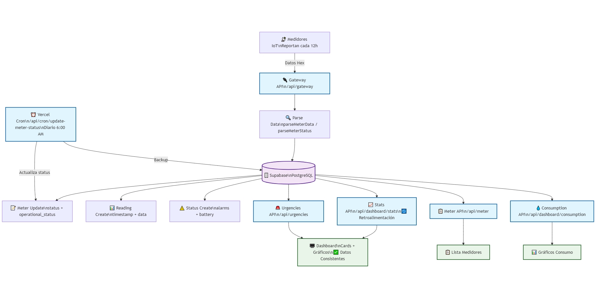
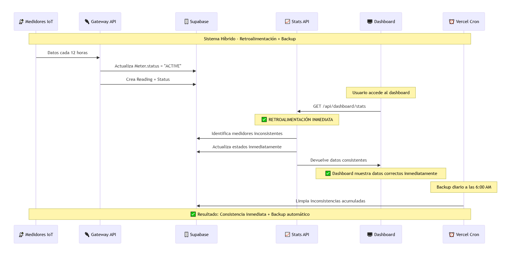
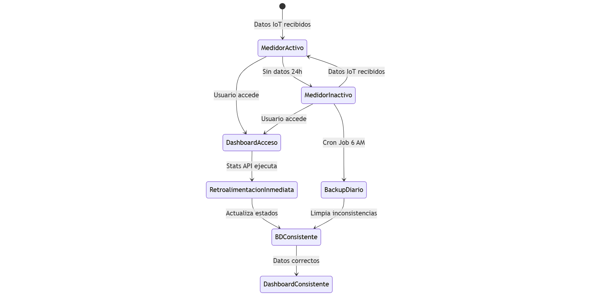

# 📘 Ecosistema EcoWater - Explicado con Diagramas

Este documento resume la arquitectura final del sistema con capturas de los diagramas Mermaid y explicaciones por elemento y por flecha.

---

## 1) Diagrama de Flujo de Datos

### Elementos

- 📡 Medidores IoT: Dispositivos que envían tramas en hex (cada ~12h).
- 🔌 Gateway API (`/api/gateway`): Punto de entrada que decodifica y persiste.
- 🔍 Parse Data: `parseMeterData` y `parseMeterStatus` interpretan payload y banderas.
- 🗄️ Supabase (PostgreSQL): Base de datos del sistema.
- 📝 Meter Update: Upsert de `Meter` (status y operational_status).
- 📊 Reading Create: Inserción de `Reading` con métricas y timestamp.
- ⚠️ Status Create: Inserción de `Status` derivado de alarmas/flags del reading.
- 📈 Stats API (`/api/dashboard/stats`): Métricas del dashboard + retroalimentación inmediata (actualiza estados si hay desfasajes).
- 🚨 Urgencies API (`/api/urgencies`): Unifica alertas (críticas y de inactividad).
- 📋 Meter API (`/api/meter`): Listado/detalle de medidores con conectividad calculada.
- 💧 Consumption API (`/api/dashboard/consumption`): Series temporales de consumo.
- ⏰ Vercel Cron (`/api/cron/update-meter-status`): Job diario 6:00 AM que sincroniza estados como “backup”.
- 🖥️ Dashboard: UI que consume métricas, alertas y gráficos.

### Flechas (qué representan)

- IoT → Gateway: Tramas hex entrantes.
- Gateway → Parse: Decodificación y normalización.
- Parse → BD: Persistencia de `Meter`, `Reading` y `Status`.
- BD → Stats/Urgencies/Meter/Consumption: Lectura de datos para endpoints de consulta.
- Cron → BD/MeterUpdate: Ajustes de estados (INACTIVE/ACTIVE) diarios.
- APIs → Dashboard: Datos que alimentan cards, tablas y gráficos.

---

## 2) Diagrama de Flujo Temporal

### Línea de tiempo resumida

- Reporte IoT (cada 12h) → Gateway actualiza BD (Meter + Reading + Status).
- Usuario abre Dashboard → Stats API calcula métricas y aplica retroalimentación inmediata (sincroniza estados si detecta inconsistencias de últimas 24h).
- 06:00 AM → Cron Job corre 1 vez/día y limpia inconsistencias residuales (respaldo en plan Hobby).

### Flechas clave

- IoT → Gateway → BD: Ciclo de ingestión de datos.
- UI → Stats API: Solicitud de métricas que puede “corregir” estados al vuelo.
- Cron → BD: Sincronización programada (baja frecuencia por plan Hobby).

---

## 3) Diagrama de Estados

### Estados y transiciones

- MedidorActivo → MedidorInactivo: Si no hay lecturas válidas en 24h.
- MedidorInactivo → MedidorActivo: Reaparecen lecturas válidas.
- Acceso al Dashboard → Retroalimentación Inmediata: Stats API verifica y actualiza `Meter.status` según readings recientes.
- Backup Diario (Cron 6:00 AM) → BD Consistente: Segunda capa de convergencia si no hubo tráfico.

---

## Notas de operación

- La retroalimentación inmediata garantiza consistencia “en el momento de uso”.
- El cron diario reduce ventanas residuales de inconsistencia en entornos de bajo tráfico.
- `totalAlerts` del dashboard = cantidad de medidores inactivos (alineado con Urgencies “inactive”).

## Regenerar diagramas (opcional)

- Fuente Mermaid en `docs/diagrams/`.
- Exportar con mermaid-cli o Mermaid Live Editor (SVG/PNG).
