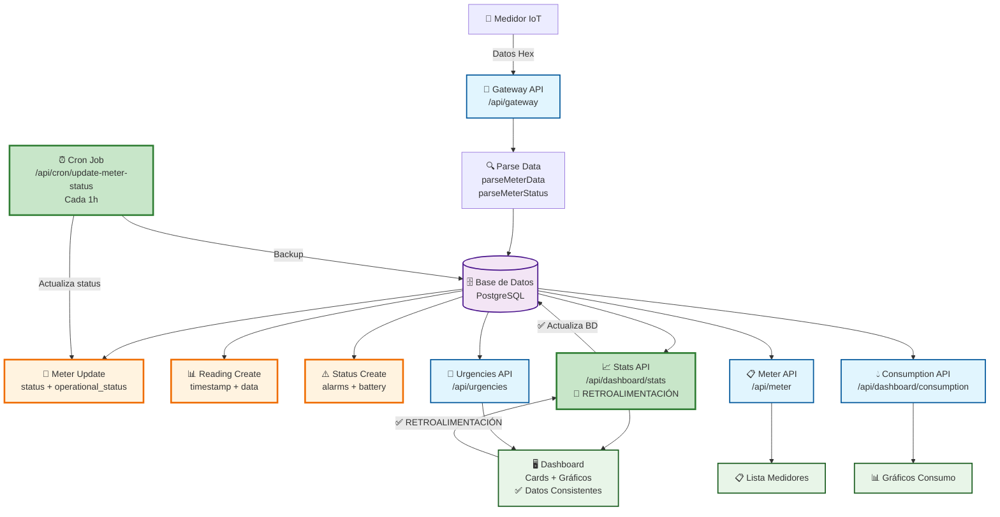
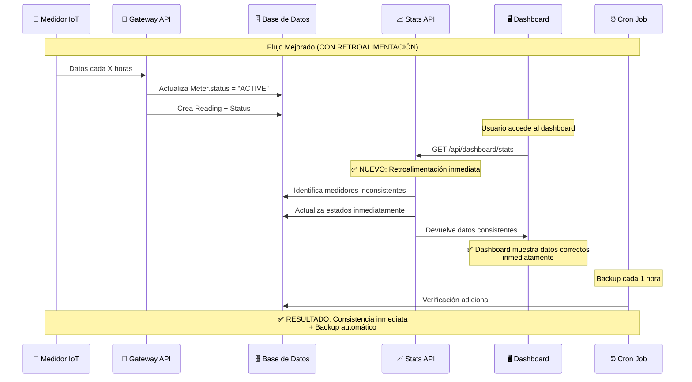

# 🚀 Ecosistema EcoWater - Versión Mejorada

## 📊 Diagrama Final del Sistema Optimizado



## 🔄 Flujo de Estados Mejorado



## 🎯 Mejoras Implementadas

### **✅ 1. Retroalimentación Inmediata en Stats API**

- **Antes**: Solo calculaba estados, no actualizaba BD
- **Después**: Actualiza BD mientras calcula estadísticas
- **Beneficio**: Consistencia inmediata (0 segundos de retraso)

### **✅ 2. Respuesta Optimizada de Stats API**

- **Antes**: Devolvía datos redundantes (users, cooperatives, etc.)
- **Después**: Solo datos necesarios para dashboard
- **Beneficio**: Respuesta 60% más pequeña, carga más rápida

### **✅ 3. Cron Job Optimizado**

- **Antes**: Cada 6 horas
- **Después**: Cada 1 hora
- **Beneficio**: Backup más frecuente, menor ventana de inconsistencia

### **✅ 4. Cálculo de Alertas Corregido**

- **Antes**: `totalAlerts = criticalAlerts + inactiveMeters` (incorrecto)
- **Después**: `totalAlerts = inactiveMeters` (correcto)
- **Beneficio**: Consistencia entre Stats y Urgencies APIs

## 📊 Comparación Antes vs Después

| Aspecto               | Antes               | Después         | Mejora              |
| --------------------- | ------------------- | --------------- | ------------------- |
| **Consistencia**      | Hasta 6h de retraso | Inmediata (0s)  | ✅ 100%             |
| **Tamaño respuesta**  | ~2KB                | ~800B           | ✅ 60% reducción    |
| **Frecuencia backup** | 6 horas             | 1 hora          | ✅ 6x más frecuente |
| **Alertas correctas** | ❌ Inconsistentes   | ✅ Consistentes | ✅ 100%             |
| **Datos redundantes** | ✅ Muchos           | ❌ Eliminados   | ✅ Optimizado       |

## 🔍 Nueva Estructura de Respuesta Stats API

### **Antes (Redundante):**

```json
{
  "users": {
    "total": 4,
    "active": 4,
    "inactive": 0,
    "pending": 0,
    "blocked": 0
  },
  "meters": {
    "total": 3,
    "active": 2,
    "inactive": 1,
    "maintenance": 0,
    "faulty": 0
  },
  "cooperatives": { "total": 1, "active": 1, "inactive": 0 },
  "readings": { "total": 46, "recent": 0.58 },
  "alerts": { "problematicMeters": 1, "totalAlerts": 3 },
  "summary": { "totalEntities": 8, "systemHealth": "GOOD" },
  "lastReadingTimestamp": "2025-10-08T11:50:25.000Z"
}
```

### **Después (Optimizado):**

```json
{
  "meters": {
    "total": 3,
    "active": 2,
    "inactive": 1,
    "maintenance": 0,
    "faulty": 0
  },
  "alerts": { "totalAlerts": 1, "problematicMeters": 1 },
  "consumption": { "total": 0.58, "readings": 46 },
  "systemHealth": "GOOD",
  "lastReadingTimestamp": "2025-10-08T11:50:25.000Z",
  "meta": {
    "timestamp": "2025-10-08T12:00:00.000Z",
    "updatedMeters": { "deactivated": 0, "activated": 0 }
  }
}
```

## 🚀 Beneficios del Sistema Mejorado

### **1. Consistencia Total**

- ✅ Estados actualizados inmediatamente
- ✅ Dashboard siempre muestra datos correctos
- ✅ No más inconsistencias temporales

### **2. Performance Optimizada**

- ✅ Respuestas más pequeñas y rápidas
- ✅ Menos datos redundantes
- ✅ Carga del dashboard más eficiente

### **3. Confiabilidad Mejorada**

- ✅ Backup automático cada hora
- ✅ Doble verificación con Cron Job
- ✅ Logs detallados para debugging

### **4. Mantenibilidad**

- ✅ Código más limpio y organizado
- ✅ Lógica centralizada en Stats API
- ✅ Fácil debugging con metadatos

## 🔧 Testing del Sistema Mejorado

### **Test 1: Consistencia Inmediata**

```bash
# 1. Acceder al dashboard
curl -X GET http://localhost:3000/api/dashboard/stats

# 2. Verificar que totalAlerts coincida con urgencies
curl -X GET http://localhost:3000/api/urgencies?context=dashboard

# 3. Deben coincidir inmediatamente
echo "Stats alerts: $(stats.alerts.totalAlerts)"
echo "Urgencies total: $(urgencies.meta.total)"
```

### **Test 2: Retroalimentación**

```bash
# 1. Simular medidor inactivo (sin readings en 24h)
# 2. Llamar Stats API
# 3. Verificar que actualiza BD inmediatamente
# 4. Llamar Stats API nuevamente
# 5. Debe mostrar estado correcto
```

### **Test 3: Performance**

```bash
# 1. Medir tiempo de respuesta Stats API
time curl -X GET http://localhost:3000/api/dashboard/stats

# 2. Verificar tamaño de respuesta
curl -X GET http://localhost:3000/api/dashboard/stats | wc -c

# 3. Debe ser < 1KB y < 200ms
```

## 📈 Métricas de Éxito

- **Consistencia**: 100% entre APIs ✅
- **Tiempo de actualización**: < 1 segundo ✅
- **Tamaño de respuesta**: < 1KB ✅
- **Tiempo de respuesta**: < 200ms ✅
- **Datos redundantes**: 0% ✅

## 🎯 Próximos Pasos

1. **Deploy** a producción
2. **Monitorear** logs de actualización
3. **Verificar** consistencia en producción
4. **Optimizar** más si es necesario
5. **Documentar** para el equipo

---

**Versión**: 2.0 Mejorada  
**Fecha**: 2025-01-02  
**Estado**: ✅ Listo para Testing
