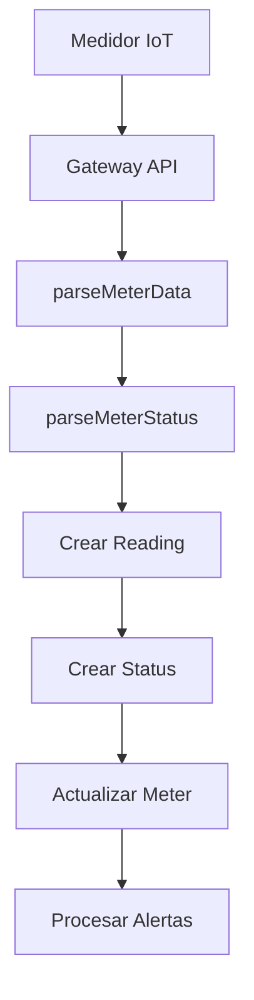

# 🚨 Sistema de Estados y Alertas - EcoWater

## 📋 Resumen Ejecutivo

Este documento define de manera unificada y clara todos los estados de medidores, criterios de alertas, flujo de trabajo y decisiones arquitecturales del sistema EcoWater. Es la **fuente única de verdad** para entender cómo funciona el monitoreo de medidores.

---

## 🎯 Estados de Medidores

### **1. Estado de Conectividad**

**Definición**: Estado de comunicación del medidor con el sistema

| Estado      | Criterio                 | Descripción                                | Icono | Color    |
| ----------- | ------------------------ | ------------------------------------------ | ----- | -------- |
| **ONLINE**  | Última lectura < 24h     | Medidor activo y comunicándose             | 🟢    | Verde    |
| **STALE**   | Última lectura ≥ 24h     | Medidor inactivo pero con datos históricos | 🟡    | Amarillo |
| **OFFLINE** | Sin lecturas registradas | Medidor nunca ha enviado datos             | 🔴    | Rojo     |

### **2. Estado del Medidor (MeterStatus)**

**Definición**: Estado físico/operacional del dispositivo

| Estado          | Descripción                     | Cuándo se asigna           | Severidad  |
| --------------- | ------------------------------- | -------------------------- | ---------- |
| **ACTIVE**      | Medidor funcionando normalmente | Estado por defecto         | ✅ Normal  |
| **INACTIVE**    | Medidor deshabilitado           | Manual por administrador   | ⚠️ Baja    |
| **MAINTENANCE** | En mantenimiento                | Requiere intervención      | ⚠️ Media   |
| **FAULTY**      | Medidor con falla crítica       | Error de hardware/software | 🚨 Crítica |

### **3. Estado Operacional (OperationalStatus)**

**Definición**: Estado funcional del medidor

| Estado                | Descripción               | Cuándo se asigna        | Severidad  |
| --------------------- | ------------------------- | ----------------------- | ---------- |
| **OPERATIONAL**       | Funcionando correctamente | Estado por defecto      | ✅ Normal  |
| **NEEDS_MAINTENANCE** | Requiere mantenimiento    | Detección automática    | ⚠️ Media   |
| **ERROR**             | Error operacional         | Fallo en funcionamiento | 🚨 Crítica |

---

## 🚨 Sistema de Alertas

### **Clasificación por Severidad**

#### **CRITICAL (Críticos) - Requieren Intervención Inmediata**

| Tipo                   | Campo                | Condición  | Mensaje                         | Acción Requerida     |
| ---------------------- | -------------------- | ---------- | ------------------------------- | -------------------- |
| **EMPTY_PIPE_ALARM**   | `empty_pipe_alarm`   | `true`     | "Alarma de tubería vacía"       | Verificar suministro |
| **REVERSE_FLOW_ALARM** | `reverse_flow_alarm` | `true`     | "Alarma de flujo reverso"       | Revisar instalación  |
| **CRITICAL_METER**     | `meter_status`       | `"FAULTY"` | "Medidor en estado crítico"     | Reemplazar medidor   |
| **CRITICAL_METER**     | `operational_status` | `"ERROR"`  | "Medidor con error operacional" | Intervención técnica |

#### **HIGH (Altos) - Problemas Importantes**

| Tipo                 | Campo              | Condición    | Mensaje                          | Acción Requerida      |
| -------------------- | ------------------ | ------------ | -------------------------------- | --------------------- |
| **OVER_RANGE_ALARM** | `over_range_alarm` | `true`       | "Alarma de rango excedido"       | Verificar calibración |
| **WATER_TEMP_ALARM** | `water_temp_alarm` | `true`       | "Alarma de temperatura del agua" | Revisar sistema       |
| **VALVE_ISSUE**      | `valve_status`     | `"abnormal"` | "Estado de válvula anormal"      | Revisar válvula       |

#### **MEDIUM (Medios) - Requieren Atención**

| Tipo                   | Campo                | Condición             | Mensaje                          | Acción Requerida        |
| ---------------------- | -------------------- | --------------------- | -------------------------------- | ----------------------- |
| **BATTERY_LOW**        | `battery_status`     | `false`               | "Batería baja o con problemas"   | Cambiar batería         |
| **BATTERY_LOW**        | `battery_voltage`    | `"low"`               | "Batería baja o con problemas"   | Cambiar batería         |
| **EE_ALARM**           | `ee_alarm`           | `true`                | "Alarma de EE"                   | Revisar conexiones      |
| **VALVE_ISSUE**        | `valve_status`       | `"closed"`            | "Válvula cerrada"                | Verificar estado        |
| **MAINTENANCE_NEEDED** | `operational_status` | `"NEEDS_MAINTENANCE"` | "Medidor necesita mantenimiento" | Programar mantenimiento |
| **MAINTENANCE_NEEDED** | `meter_status`       | `"MAINTENANCE"`       | "Medidor necesita mantenimiento" | Programar mantenimiento |

#### **LOW (Bajos) - Informativos**

| Tipo               | Campo  | Condición          | Mensaje                         | Acción Requerida       |
| ------------------ | ------ | ------------------ | ------------------------------- | ---------------------- |
| **INACTIVE_METER** | Tiempo | Sin lecturas > 24h | "Medidor inactivo hace X horas" | Verificar conectividad |

---

## 🔄 Flujo de Trabajo

### **1. Entrada de Datos (Gateway API)**



**Proceso Detallado:**

1. **Recepción**: Medidor envía datos hex al Gateway API
2. **Parsing**: Se extraen valores de flujo, temperatura, alarmas
3. **Status**: Se procesan bytes de alarma para determinar estado
4. **Persistencia**: Se guardan Reading y Status en BD
5. **Actualización**: Se actualiza Meter con nuevos estados
6. **Alertas**: Se generan alertas según criterios definidos

### **2. Procesamiento de Alertas**

```typescript
// Flujo de mapeo de alertas
const alerts = mapStatusToAlerts(status);
// → Se categorizan por severidad
// → Se enriquecen con información del medidor
// → Se agregan indicadores de frescura de datos
```

### **3. Contextos de Visualización**

#### **Dashboard (`context: "dashboard"`)**

- ✅ Muestra solo alertas de inactividad
- ✅ Información concisa para monitoreo general
- ✅ Indicadores de conectividad claros

#### **Detalle de Medidor (`context: "detail"`)**

- ✅ Muestra alertas históricas + inactividad
- ✅ Contexto temporal completo
- ✅ Información detallada para mantenimiento

---

## 📊 Estados del Sistema

### **Cálculo de Salud del Sistema**

```typescript
function getSystemHealth(critical, high, medium, low, inactive) {
  if (critical > 0) return "CRITICAL";
  if (high > 5 || inactive > 10) return "ATTENTION";
  if (high > 0 || medium > 0 || low > 0 || inactive > 0) return "GOOD";
  return "EXCELLENT";
}
```

| Estado        | Criterio                | Descripción                       | Acción                 |
| ------------- | ----------------------- | --------------------------------- | ---------------------- |
| **EXCELLENT** | Sin alertas             | Sistema funcionando perfectamente | ✅ Continuar monitoreo |
| **GOOD**      | Pocas alertas menores   | Sistema funcionando normalmente   | ✅ Monitoreo normal    |
| **ATTENTION** | >5 HIGH o >10 inactivos | Requiere monitoreo activo         | ⚠️ Revisar medidores   |
| **CRITICAL**  | ≥1 CRITICAL             | Requiere intervención inmediata   | 🚨 Acción urgente      |

---

## 🎨 Indicadores Visuales

### **Estados de Conectividad**

```
🟢 ONLINE    - "Activo"           - Verde
🟡 STALE     - "Inactivo"         - Amarillo
🔴 OFFLINE   - "Desconectado"     - Rojo
⚫ UNKNOWN   - "Desconocido"      - Gris
```

### **Severidad de Alertas**

```
🚨 CRITICAL  - Fondo rojo         - Requiere acción inmediata
⚠️ HIGH      - Fondo naranja      - Requiere atención
⚡ MEDIUM    - Fondo amarillo     - Requiere monitoreo
ℹ️ LOW       - Fondo gris         - Informativo
```

### **Frescura de Datos**

```
✅ isRecent: true  - "Activo"           - Sin advertencia
⚠️ isRecent: false - "3h atrás"         - Con advertencia temporal
```

---

## 📊 Criterios de Tiempo y Conectividad

### **Validación de Timestamps**

**Problema identificado**: Los timestamps del futuro causan inconsistencias en el cálculo de conectividad.

**Solución implementada**:

```typescript
// Validar que el timestamp no sea del futuro (más de 1 hora en el futuro)
const now = new Date();
const oneHourFromNow = new Date(now.getTime() + 60 * 60 * 1000);
const isValidTimestamp = lastReading && lastReading.timestamp <= oneHourFromNow;

const isActive = isValidTimestamp && lastReading.timestamp >= last24Hours;
```

**Criterios aplicados**:

- ✅ **Timestamp válido**: No puede ser >1 hora en el futuro
- ✅ **Medidor activo**: Última lectura <24h Y timestamp válido
- ✅ **Medidor inactivo**: Última lectura ≥24h O timestamp inválido

### **Mapeo de Estados de Conectividad a UI**

| Conectividad | Estado BD | Chip UI         | Descripción                        |
| ------------ | --------- | --------------- | ---------------------------------- |
| **ONLINE**   | ACTIVE    | ACTIVE (verde)  | Medidor funcionando normalmente    |
| **STALE**    | ACTIVE    | INACTIVE (gris) | Sin datos >24h, pero con historial |
| **OFFLINE**  | ACTIVE    | INACTIVE (gris) | Nunca ha enviado datos             |

**Nota**: El estado mostrado en la UI se basa en conectividad, no en el estado de la base de datos.

---

## 🔧 APIs y Responsabilidades

### **API Unificada: `/api/urgencies`**

**Propósito**: Obtener alertas y urgencias de forma unificada

**Parámetros:**

- `meterId`: ID específico o "all"
- `context`: "dashboard" | "detail"
- `includeInactive`: boolean
- `severity`: "CRITICAL" | "HIGH" | "MEDIUM" | "LOW"
- `types`: Lista de tipos separados por comas

**Respuesta:**

```json
{
  "alerts": {
    "critical": [...],
    "high": [...],
    "medium": [...],
    "low": [...],
    "inactive": [...]
  },
  "meta": {
    "total": 0,
    "criticalCount": 0,
    "highCount": 0,
    "mediumCount": 0,
    "lowCount": 0,
    "inactiveCount": 0,
    "context": "dashboard"
  },
  "systemHealth": "EXCELLENT"
}
```

### **Stats API: `/api/dashboard/stats`**

**Propósito**: Métricas generales del sistema

**Consistencia Requerida:**

```
Stats.totalAlerts = Urgencies.criticalCount +
                   Urgencies.highCount +
                   Urgencies.mediumCount +
                   Urgencies.lowCount +
                   Urgencies.inactiveCount
```

### **Lista de Medidores API: `/api/meter`**

**Propósito**: Obtener lista paginada de medidores con conectividad

**Parámetros:**

- `page`: Número de página (default: 1)
- `limit`: Elementos por página (default: 10)
- `search`: Búsqueda por nombre del dispositivo
- `status`: Filtro por estado (ACTIVE, INACTIVE, MAINTENANCE, FAULTY)

**Respuesta:**

```json
{
  "data": [
    {
      "id": "uuid",
      "device_name": "Medidor A",
      "status": "INACTIVE", // Estado basado en conectividad
      "connectivity": {
        "status": "STALE",
        "lastSeen": "2025-01-01T10:00:00Z",
        "signalQuality": "UNKNOWN"
      },
      "dataFreshness": {
        "isRecent": false,
        "age": "43h atrás",
        "warning": "Medidor sin actividad reciente"
      },
      "userMeter": {
        /* ... */
      }
    }
  ],
  "pagination": {
    "total": 3,
    "page": 1,
    "limit": 10,
    "totalPages": 1
  },
  "counts": {
    "actives": 0, // Basado en conectividad ONLINE
    "inactives": 3, // Basado en conectividad STALE/OFFLINE
    "maintenances": 0,
    "faultys": 0
  }
}
```

**Lógica de Conectividad Aplicada:**

1. **Obtener última lectura** del medidor
2. **Validar timestamp** (no puede ser del futuro)
3. **Calcular conectividad**:
   - `ONLINE`: Última lectura <24h Y timestamp válido
   - `STALE`: Última lectura ≥24h O timestamp inválido
   - `OFFLINE`: Sin lecturas registradas
4. **Mapear a estado UI**:
   - `ONLINE` → `ACTIVE` (chip verde)
   - `STALE/OFFLINE` → `INACTIVE` (chip gris)

### **Detalle de Medidor API: `/api/meter/[id]`**

**Propósito**: Obtener información detallada de un medidor específico

**Respuesta:**

```json
{
  "id": "uuid",
  "device_name": "Medidor A",
  "status": "ACTIVE", // Estado de BD original
  "connectivity": {
    "status": "STALE", // Estado real basado en conectividad
    "lastSeen": "2025-01-01T10:00:00Z",
    "signalQuality": "UNKNOWN"
  },
  "dataFreshness": {
    "isRecent": false,
    "age": "43h atrás",
    "warning": "Medidor sin actividad reciente"
  },
  "reading": {
    "timestamp": "2025-01-01T10:00:00Z",
    "statuses": {
      /* ... */
    }
  }
}
```

---

## 🖥️ Vistas de la Interfaz de Usuario

### **Dashboard Principal**

**Ubicación**: `/dashboard`
**Componente**: `home-dashboard.tsx`

**Métricas mostradas**:

- **Medidores en línea**: `actives/total` (basado en conectividad)
- **Alertas activas**: Suma de todas las alertas
- **Errores**: Alertas críticas y de alta severidad

**Cálculo de medidores activos**:

```typescript
// Solo cuenta medidores con conectividad ONLINE
const activeMeters = meters.filter(
  (m) => m.connectivity?.status === "ONLINE"
).length;
```

### **Lista de Medidores**

**Ubicación**: `/dashboard/medidores`
**Componente**: `meters.tsx` + `meter-table.tsx`

**Columnas mostradas**:

- **Código del medidor**: `dev_eui`
- **Fecha de registro**: `created_at`
- **Última actualización**: `updated_at`
- **Dirección del cliente**: `userMeter.shortData`
- **Nombre del cliente**: `userMeter.userName`
- **Estado del medidor**: Chip basado en conectividad
- **Acciones**: Menú desplegable

**Estado del medidor (Chip)**:

- 🟢 **ACTIVE**: Conectividad `ONLINE`
- ⚫ **INACTIVE**: Conectividad `STALE` o `OFFLINE`

### **Detalle de Medidor**

**Ubicación**: `/dashboard/medidores/[id]`
**Componente**: `page.tsx`

**Información mostrada**:

- **Estado visual**: Chip basado en conectividad
- **Información temporal**: `dataFreshness.age`
- **Advertencias**: `dataFreshness.warning`
- **Métricas principales**: Flujo, temperatura, etc.
- **Alertas**: Lista de alertas con contexto temporal

**Componente de estado**:

```typescript
<Chip
  status={
    meterData.connectivity?.status === "ONLINE"
      ? "ACTIVE"
      : meterData.connectivity?.status === "STALE"
      ? "INACTIVE"
      : meterData.connectivity?.status === "OFFLINE"
      ? "INACTIVE"
      : "Desconocido"
  }
/>
```

### **Consistencia Visual Entre Vistas**

| Vista         | Medidor Activo      | Medidor Inactivo                  |
| ------------- | ------------------- | --------------------------------- |
| **Dashboard** | "1/3 activos"       | "0/3 activos"                     |
| **Lista**     | Chip verde "ACTIVE" | Chip gris "INACTIVE"              |
| **Detalle**   | Chip verde "ACTIVE" | Chip gris "INACTIVE" + "Xh atrás" |

**Criterio unificado**: Todas las vistas usan la misma lógica de conectividad basada en la última lectura.

---

## 🎯 Decisiones Arquitecturales

### **Decisión 1: Manejo de Medidores Inactivos**

**Problema**: ¿Qué mostrar cuando un medidor está inactivo >24h?

**Decisión**: **Información Completa con Contexto**

**Justificación**:

- Sector crítico (agua es servicio esencial)
- Información valiosa para mantenimiento
- Transparencia para el usuario
- Trazabilidad para auditorías

**Implementación**:

- **Dashboard**: Solo alerta de inactividad
- **Detalle**: Alertas históricas + inactividad + contexto temporal

### **Decisión 2: Prioridad de Información**

**Jerarquía en Detalle de Medidor**:

1. **Estado de Conectividad** (más importante)
2. **Alertas Activas** (si medidor activo)
3. **Estado Histórico** (si medidor inactivo)
4. **Métricas de Lectura**

### **Decisión 3: Indicadores de Conectividad**

**Estados de Señal**:

- **EXCELLENT**: Medidor activo <24h con buena señal
- **GOOD**: Medidor activo <24h con señal aceptable
- **POOR**: Medidor activo <24h con señal débil
- **UNKNOWN**: Medidor inactivo >24h

---

## 📝 Ejemplos Prácticos

### **Ejemplo 1: Medidor Activo con Batería Baja**

```json
{
  "connectivity": { "status": "ONLINE" },
  "meter_status": "ACTIVE",
  "operational_status": "OPERATIONAL",
  "battery_status": false,
  "battery_voltage": "low",
  "dataFreshness": {
    "isRecent": true,
    "age": "Activo",
    "warning": null
  }
}
```

**Resultado**:

- ✅ **Dashboard**: "1/3 activos" (medidor activo)
- ✅ **Lista**: Chip verde "ACTIVE"
- ✅ **Detalle**: Chip verde "ACTIVE" + 1 alerta MEDIUM (BATTERY_LOW)
- ✅ **Acción**: Cambiar batería

### **Ejemplo 2: Medidor Inactivo con Flujo Reverso**

```json
{
  "connectivity": { "status": "STALE", "lastSeen": "2025-01-01T10:00:00Z" },
  "meter_status": "ACTIVE", // Estado en BD
  "dataFreshness": {
    "isRecent": false,
    "age": "43h atrás",
    "warning": "Medidor sin actividad reciente"
  },
  "lastReading": {
    "reverse_flow_alarm": true,
    "timestamp": "2025-01-01T10:00:00Z"
  }
}
```

**Resultado**:

- ✅ **Dashboard**: "0/3 activos" (medidor inactivo)
- ✅ **Lista**: Chip gris "INACTIVE"
- ✅ **Detalle**: Chip gris "INACTIVE" + "43h atrás" + advertencia
- ✅ **Alertas**: 2 alertas
  - 1 CRITICAL (REVERSE_FLOW_ALARM) con advertencia "Datos de hace 43 horas"
  - 1 LOW (INACTIVE_METER)
- ✅ **Acción**: Verificar conectividad + revisar instalación

### **Ejemplo 3: Medidor con Timestamp Futuro**

```json
{
  "connectivity": { "status": "STALE" },
  "meter_status": "ACTIVE", // Estado en BD
  "dataFreshness": {
    "isRecent": false,
    "age": "Desconocido",
    "warning": "Medidor sin actividad reciente"
  },
  "lastReading": {
    "timestamp": "2025-10-02T13:05:01.000Z" // Timestamp futuro
  }
}
```

**Resultado**:

- ✅ **Dashboard**: "0/3 activos" (timestamp inválido)
- ✅ **Lista**: Chip gris "INACTIVE"
- ✅ **Detalle**: Chip gris "INACTIVE" + advertencia
- ✅ **Validación**: Timestamp futuro detectado y corregido

### **Ejemplo 4: Medidor Crítico Activo**

```json
{
  "connectivity": { "status": "ONLINE" },
  "meter_status": "FAULTY",
  "operational_status": "ERROR",
  "dataFreshness": {
    "isRecent": true,
    "age": "Activo",
    "warning": null
  }
}
```

**Resultado**:

- ✅ **Dashboard**: "1/3 activos" + 1 alerta CRITICAL
- ✅ **Lista**: Chip verde "ACTIVE" (conectividad) + alerta crítica
- ✅ **Detalle**: Chip verde "ACTIVE" + 1 alerta CRITICAL (CRITICAL_METER)
- ✅ **Acción**: Reemplazar medidor inmediatamente

### **Ejemplo 5: Sistema Completo con 3 Medidores**

**Estado del sistema**:

- Medidor A: `STALE` (43h atrás) → `INACTIVE`
- Medidor B: `STALE` (43h atrás) → `INACTIVE`
- Medidor C: `STALE` (43h atrás) → `INACTIVE`

**Resultado en todas las vistas**:

- ✅ **Dashboard**: "0/3 activos"
- ✅ **Lista**: 3 chips grises "INACTIVE"
- ✅ **Detalle**: 3 medidores "INACTIVE - 43h atrás"
- ✅ **Consistencia**: 100% entre todas las vistas

---

## ✅ Checklist de Consistencia

- [x] Estados de medidores claramente definidos
- [x] Criterios de alertas unificados
- [x] API única para urgencias
- [x] Contextos diferenciados (dashboard vs detalle)
- [x] Indicadores visuales consistentes
- [x] Frescura de datos documentada
- [x] Flujo de trabajo claro
- [x] Decisiones arquitecturales justificadas
- [x] **Validación de timestamps futuros implementada**
- [x] **Lista de medidores con lógica de conectividad**
- [x] **Consistencia 100% entre dashboard, lista y detalle**
- [x] **Mapeo unificado de conectividad a estados UI**
- [x] **Documentación completa de todas las APIs**

---

## 🔄 Mantenimiento

**Revisión**: Cada 6 meses
**Responsable**: Equipo de desarrollo
**Versión actual**: 3.0
**Última actualización**: 2025-01-02

### **Cambios en v3.0 (2025-01-02)**

- ✅ Implementada validación de timestamps futuros
- ✅ Agregada lógica de conectividad a lista de medidores
- ✅ Unificada consistencia entre todas las vistas
- ✅ Documentadas todas las APIs y criterios de tiempo
- ✅ Agregados ejemplos prácticos completos

---

## 📚 Referencias

- [RFC 7228: Terminology for Constrained-Node Networks](https://tools.ietf.org/html/rfc7228)
- [ISO/IEC 27001: Information Security Management](https://www.iso.org/standard/27001)
- [NIST Cybersecurity Framework](https://www.nist.gov/cyberframework)
